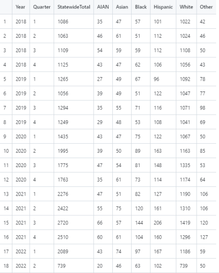

Our original data started as three separate data tables. The data from “Death By Residence of the Decedents” and “Death by Race” were collected by the Washington Department of Health which can be found using this link:

doh.wa.gov/sites/default/files/2022-02/wa_lhj_quarterly_report_18_1_2_pub.html?uid=62460d6486360. 

The data from the U.S. Census Bureau can be found using this link: 

www.census.gov/quickfacts/fact/table/US/PST045222. 

Variables we included from these data sets that are in our final dataset are: “Year”, “Quarter”, “StatewideTotal”,  “White,” “Black,” “AIAN,” “Asian,” “Hispanic,” and “Other.” “Year” and “Quarter” are used so that we can see the amount of overdose deaths broken down by each quarter of the years between 2018-2022. “Statewide Total” is a variable that sums all of the deaths in that given quarter from all of the race variables. All of our other variables are the races that our data is broken down into, meaning the numbers in the columns represent how many people of a certain race died in a specific quarter.

Here is the final dataset we used:

Our final dataset had 18 rows and 9 columns. We filtered out all of the missing values so that there are none. 

