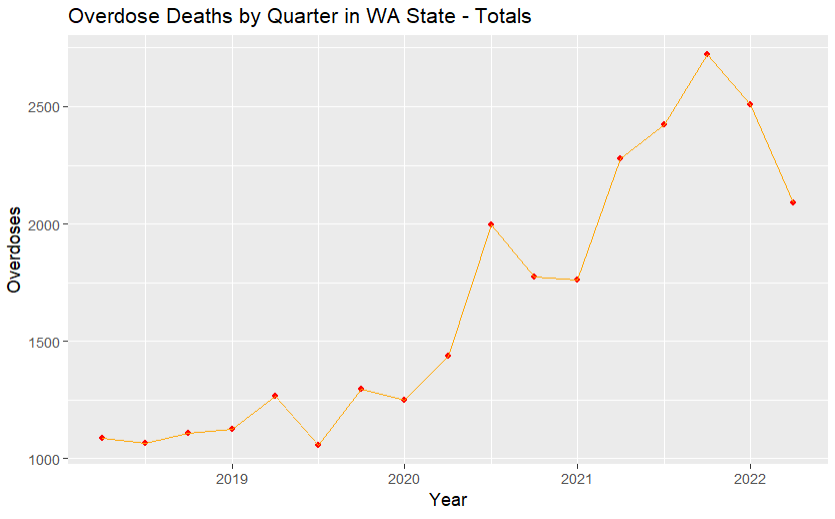
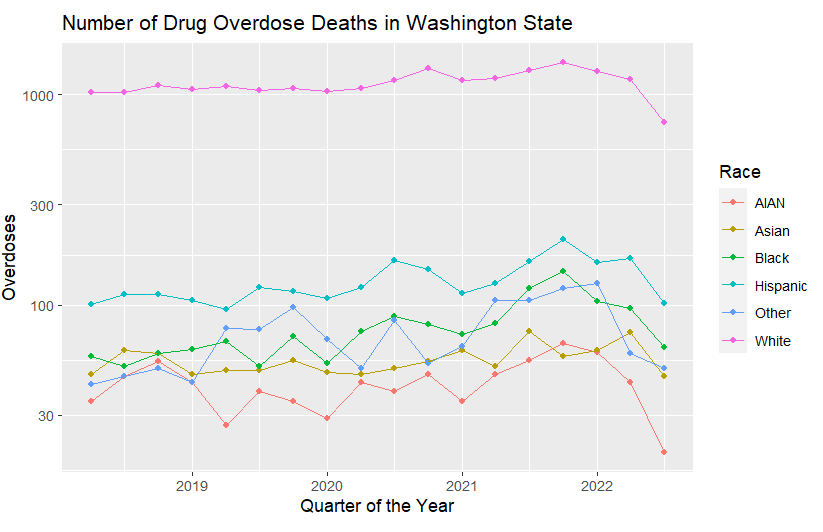
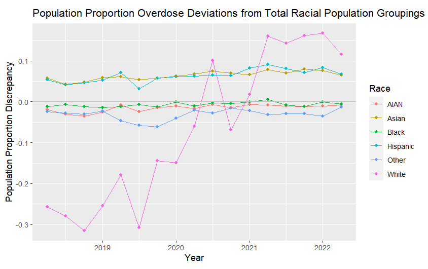

# Intro

In recent years, there has been a substantial increase in the number of deaths in the United States related to drug overdoses. In fact, according to the Centers for Disease Control (CDC) and Prevention, over “one million people have died since 1999 [to 2021],” and the number of deaths continues to increase year over year drastically. The CDC also states that overdose deaths are a leading cause of injury-related death in the United States, with the majority of overdose deaths involving opioids. In general, the rising prevalence of drug abuse through opioids such as fentanyl, heroin, morphine, and other emerging synthetic opioids has caused record-breaking levels of fatalities in recent years. Despite these drugs being incredibly dangerous, their chemical makeup and market demand have nevertheless made them particularly addictive, dangerous, and in many cases, lethal.

To study this problem further, our team decided to investigate, analyze, and produce conclusions relating to the number of overdoses that have occurred in Washington State recently and, more specifically, how these cases have continued to increase in recent years. The crisis has impacted Washington state, causing thousands of deaths, intentionally and unintentionally, and a part of our study includes making discoveries about how particular demographics may have been disproportionately affected as a result. Additionally, we wanted to study how particular ethnic groups may have been disproportionately impacted by the lethal effects drugs can have.

While opioids are often prescribed for short-term pain, sometimes they are overprescribed, which can lead to addiction and abuse. This trend of overprescribing opioids began in the 1990s when pain was declared as the “fifth vital sign.” This meant that pain became a requirement of proper patient care and was as important to assess as other health markers such as blood pressure, temperature, respiratory rate, and heart rate. The response by healthcare providers was to prescribe more opioids, such as oxycontin and Opana [NCBI]. When someone can no longer legally get these opioids, they might seek them out illegally to chase the high, as their body will stop producing the same amount of endorphins [Mayo Clinic]. As mentioned, what can be bought tends to be much more potent as it can contain other highly addictive substances, and the opioids in recent years are much stronger than those in the 1990s.

The questions we aim to answer in this project are: 
- How much has drug-related deaths increased in Washington State over the years?
- What is the relationship, if any, between overdose deaths in Washington and Race?
- Do these results change when relating overdosed to population percentages? 
- What factors could be causing these race-related overdose discrepancies?

Our focus on this project is first visualizing how much drug-related deaths have increased in Washington State over the years. More importantly, we are aiming to find if there is a relationship between deaths from drug use and race in Washington state. From these visualizations, we can answer if one race is more affected in Washington than others relative to their overall population percentages. Across the greater United States, there is research that shows how racial disparities have caused non-white citizens to be more heavily affected by the opioid epidemic. The CDC said, “In just one year, overdose death rates (number of drug overdose deaths per 100,000 people) increased 44% for Black people and 39% for American Indian and Alaska Native (AI/AN) people. People who have already incurred inequality in the workforce, healthcare system, and justice system are now being disproportionately affected by drug use and deaths. But this is not a new issue and comes from the persisting benefits white people experience because of the deep-rooted racism the United States still has. The Minnesota Department of Health says, “The race rate disparities in drug overdose deaths mirror other racial disparities in Minnesota, like those seen in graduation rates, infant mortality, poverty, incarceration, removal from home, unemployment, home ownership, and suicide.” We are hypothesizing that there is a similar connection in the state of Washington. 

We need to raise awareness about the epidemic at hand because it has killed and caused the suffering of many people. The death count has only increased with each coming year, and we don’t want that trend to continue. We hope that reading this report will help achieve a few key goals. First, we hope to help protect vulnerable populations by informing them of the risks of opioid use. Second, we hope to inform healthcare providers to be more cautious and responsible with their prescription of opioids. Third, we hope to inform voters to choose politicians who will do something about this issue. Finally, we hope to inform policymakers to create policies that provide services for those struggling with addiction and more regulations surrounding opioids.

# Explanation of Data 

In this analysis, we explore the relationship between race, drug-related deaths, and overall population demographics in Washington State. By utilizing datasets from the Washington Department of Health and the US Census Bureau, we aim to explore the overall trends for each race and whether there are disparities within each race from 2018 to 2022.

The datasets we used were “Death by Race,” “Death By Residence of the Decedents” from the Washington Department of Health, and the “2020 Washington State Population Estimate” from the US Census Bureau. We chose to use these datasets because they aligned with our goals for the project. We wanted to show the disproportion between race and death from drugs in comparison to the total Washington population, which these datasets can show when combined. Our first two datasets come from the Washington Department of Health website. This data was collected from hospitals in Washington State and reported to the DOH’s Center for Health Statistics (Death Certificates and Comprehensive Hospital Abstract Reporting System (CHARS)). 

The data we utilized is freely available to everyone. The DOH is a public entity that has instructions on its website about how to download and manipulate the data. Our first dataset, “Death by Race,” tells the count of drug-related deaths by race from the years 2018-2022. The second dataset, “Death By Residence of the Decedents,” shows the deceased's county, drug, and year of death. Our last dataset was collected from the population of Washington State in 2020 from the US Census. This is also a public entity with downloadable data and facts. All of our datasets are from population sizes rather than samples because the data from our first two datasets are based on counts that come directly from hospitals in Washington. The way the Census is collected is by obtaining information from every resident in the United States therefore, the Washington population breakdown is collected from population data rather than a sample.

First, “Death by Race” only collected how many people of different races died due to drug overdoses instead of the percentage of people who died due to drug overdoses by race. This could make the final graph disproportional and misleading. For example, since White people have a larger percentage of the total population in Washington state, a higher count of White individuals who died due to drug overdoses might be because of the population instead of a higher percentage of people who died due to drug overdoses. Also, our Washington population by race data from the U.S. Census Bureau is an estimate from the “2020 Washington State Population Estimate,” which might differ from the actual population.

For our final Dataset, we have merged the “Death by Race” and “Death By Residence of the Decedents” so that we could have each race’s drug overdose death compared with the statewide drug overdoses for each quarter from 2018 to 2020 second quarter. Each row represents a quarter of the year and how many overdose deaths in Washington state and for each race. Our final Dataset consists of 18 rows and 9 columns. We eliminated all unnecessary variables, leaving us with the “year” and “quarter” for the date. The “statewide” is the total number of overdose deaths that happened in Washington state in a specific year and quarter. And then we have the death counts for American Indians and Alaska Natives (AIAN), Asian, Black, Hispanic, White, and Other.

Since we did plenty of data cleaning, our final dataset should not have any other quality issues. The only issue is that we didn’t have the value for Native Hawaiian and Other Pacific Islander overdose death counts from the “Death by Race” dataset when we merged “Death by Race” with “2020 Washington State Population Estimate”. Therefore, we included the Native Hawaiian and Other Pacific Islander Native Americans in the “Other” category when we did a graph for the ratio between different races of people who get drug overdoses with the total population of that race in Washington state. By doing so, we hope we can graph the correct ratio between the population and people who get overdoses in that race. 

# Methods

We decided to get the “year” and “year_quarter” for the time period, “geography” for filtering statewide data, and “count” for how many deaths occurred due to overdoses from the “Death By Residence of the Decedents.” For “Death by Race,” we selected “year” and “quarter” for the time period, “race” for racial identities for the death, and “count” for how many people in a specific race died in a quarter. From the US Census Bureau, we get the population based on race in the “2020 Washington State Population Estimate”. The variables are “White alone,” “Black or African American alone,” “American Indian and Alaska Native alone,” “Asian alone,” “Native Hawaiian and Other Pacific Islander alone,” and “Others.” By getting the population based on race we can calculate the proportion discrepancies for each race overdoses so that we can make a comparison from our final dataset’s graph which will be plotted based on counts instead of percentages.

First, we changed the “year_quarter” into “Quarter” for the “Death By Residence of the Decedents” dataset by mutating so that later on, when we need to merge the datasets, it will be easier to match the values. For the “2020 Washington State Population Estimate,” we make the Others categories not only contain the original others race population but also contain the population of the Native Hawaiian and Other Pacific Islander Native Americans since we don’t have this specific race’s data in our “Death by Races.” We assumed this is included as part of the Others category in “Death by Races.” Therefore, to eliminate additional NA values or losing values while merging data, making the Others categories contain both the original other racial population data and the population of the Native Hawaiian and Other Pacific Islander Native Americans will be the best choice for us.

During the process of data cleaning, we changed the dataset from the long form to the wide form and then converted it back to the long form several times so that we could manipulate the values more efficiently. After we finished the data cleaning process, we made both the “Death By Residence of the Decedents” and “Death by Races” to wide form and “left_join” by year and quarter to get our final dataset. After merging, we realized that there are a lot of zeros suppressed values for each country, which will impact our future graphing and calculation, so these are the invalid data. Therefore, we decided to only compare the statewide death counts with the races since we cannot get a lot of actual death counts for each country. 

Before we plot the “Number of Drug Overdoses in Washington State,” we need to pivot our final dataset into long-form which consists of four columns: “year” and “quarter” for the time period, “grouping” for filtering the statewide data, “count” for the deaths for each grouping area. Then we mutate a new column, “yearPlusQuarter,” which makes “year” and “quarter” into a continuous time period from 2018 to 2022. Since the number of White people who died due to overdoses is larger compared with other races, we also used the “scale_y_log10()” method to make other racial lines clearer to see the trend and different races by colors.

For the plot of "Proportion Discrepancies of Overdoses to Ethnic Populations in WA state," we set the total population percentages for each race to be the baseline, then checked the difference between the percentage of people who died due to overdose and the baseline. We changed the value under each race variable from by counts to the difference by percentage. We match the race color we used for the plot “Number of Drug Overdoses in Washington State,” so it will be easier to make the comparison between the two graphs.

# Results

This graph shows the number of total overdoses over the year in Washington state between the years of 2018-2022. 

The first graph we constructed with our data was the Number of Overdose Deaths in Washington State by race. As shown above, this graph shows data between 2018 and the second quarter of 2022. We created this figure by using values in our final combined dataset from “Death By Residence of the Decedents” and “Death by Race.” It can be seen that the amount of overdose deaths from the White population far exceeds any other race. To create a graph that shows more comparable data, we used the 2020 Census data to create a “baseline” of the population percentages and compared the overdose death rates to them. 

As previously stated, we created a figure where the drug-related death rates by race were compared to their population proportion in Washington state to see if some races were more affected by drug overdose deaths than others. 0.0 is our baseline for the population proportion discrepancy, meaning if a race is on the 0.0 horizontal line, then their race overdose death rates compared to overall overdose death rates are equal to their population proportion, so there is not a discrepancy. If a certain race’s line is under the 0.0 horizontal,  the drug overdose death rate of that population is less than their overall population proportion, meaning there is not a discrepancy at this time for the race. If a race has a line that is over the 0.0 horizontal baseline, this means that the amount of drug-related deaths is higher than their Washington population proportion, meaning there is a discrepancy for overdose deaths of those races. This graph tells us that White, AIAN (American Indians and Alaska Natives), Asian, Hispanic, and at times Black populations are subject to higher overdose death rates compared to their population proportions.

# Findings

There is a general increasing trend in overall overdose deaths. From 2018 to late 2021, the number of deaths increased a lot, whereas it went down after late 2021. If we just look at the graph that is based on counts of death for different races. We might conclude that Whites are more likely to die due to overdoses. Nevertheless, as we back to the proportion graph, it is shocking that though the Asian death count is not high, the overdose issue disproportionately affects the Asian population in Washington state.
We found that Hispanic and Asian populations have been disproportionately affected by overdoses from 2018 to 2022. Some of the populations we thought would be more disproportionately affected ended up being proportionately affected (Black and AIAN). What surprised us most was the jump in overdoses of White populations from 2020 onward. White populations went from being proportionally underrepresented to proportionally overrepresented. This suggests another factor at play. Specifically, there would be a change in the factor around 2020 because of the dramatic increase White populations experienced and the slight rise of other populations.

It seems there could be more factors that we did not include. Race is a very broad category and might need to be further broken down to figure out what a common factor there is to explain the overdoses. Class is a factor that we did not look at because it is more common for low-income populations to get addicted and then not be able to afford services for drug addiction treatment. Without being able to afford treatment, it is more likely for someone to overdose.

I think the next step would be to break down each category further to look at income specifically. We hypothesize that there might be a higher percentage of low-income White people in Washington. The number of low-income people might have risen in 2020 because of the pandemic when people were losing their jobs. We could also look at hospitalizations during that period, as many people were getting sick. It’s possible that there were more opioids prescribed at that time, and could have caused a jump if more white people were going to hospitals.

# Summary

Drug-related deaths have increased almost exponentially in the last couple of years, and there is no downward trend in sight. Washington State and the greater United States have both seen this increase in overdose deaths. This increase in drug usage, which has grown even more rapidly since 2020, can be attributed to the overprescription of medication, more accessible access to addictive drugs, and the overall hardships our society faces from COVID-19 as a whole. Our data and analytical findings show that there is a connection between race and drug-related deaths. From our data, we found that White, AIAN (American Indians and Alaska Natives), Asian, Hispanic, and, at times, Black populations had greater overdose death rates as compared to their overall population percentage in Washington State. These connections were not quite what we hypothesized we were going to get, but many other factors can play into overdose deaths, such as social class, wealth, and pre-existing health conditions. This problem may seem daunting since the amount of overdose-related deaths is still on the rise, but there are things our society and government can do to mitigate the problem. 

We are not powerless. As voters, we have the power to vote for officials on a local, state, or federal level who make this issue a priority. We can also lobby to make this issue a priority. Some potential policies to support could include policies that aim to increase drug treatment, limit the amount of opioids prescribed, and try to stop the flow of illicit opioids.

The election for the Washington Presidential Primary is March 12, 2024, and the Washington State Primary is August 6, 2024. Check for local elections as well to make a difference in your community.

You can pick up Narcan in every pharmacy. Narcan is a nasal spray that can help to reverse an overdose [Narcan]. Similarly, you can buy Fentanyl Test Strips (FTS), which detect fentanyl that could be in other drugs [CDC].

Finally, if you are struggling with addiction, know that you are not alone, and you can call SAMHSA to find treatment in your area --
**SAMHSA hotline**: 1-800-662-4357